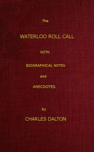

# The Waterloo Roll Call: With Biographical Notes and Anecdotes <kbd>51143</kbd>

## Authors

 - Dalton, Charles <small>(1850 - 1913)</small>

## Subjects

 - Great Britain. Army -- Registers
 - Waterloo, Battle of, Waterloo, Belgium, 1815

## Download

 - https://www.gutenberg.org/files/51143/51143-0.zip
 - https://www.gutenberg.org/cache/epub/51143/pg51143.cover.small.jpg
 - https://www.gutenberg.org/files/51143/51143-h.zip
 - https://www.gutenberg.org/files/51143/51143-h/51143-h.htm
 - https://www.gutenberg.org/ebooks/51143.html.images
 - https://www.gutenberg.org/ebooks/51143.rdf
 - https://www.gutenberg.org/ebooks/51143.epub.images
 - https://www.gutenberg.org/ebooks/51143.kindle.images

## Book Shelves

