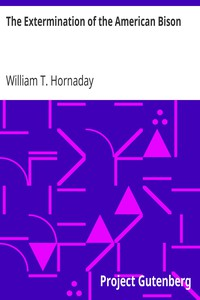

# The Extermination of the American Bison <kbd>17748</kbd>

## Authors

 - Hornaday, William T. (William Temple) <small>(1854 - 1937)</small>

## Subjects

 - American bison
 - Wildlife conservation -- United States -- Sources

## Download

 - https://www.gutenberg.org/files/17748/17748-h.zip
 - https://www.gutenberg.org/files/17748/17748.zip
 - https://www.gutenberg.org/cache/epub/17748/pg17748.cover.medium.jpg
 - https://www.gutenberg.org/files/17748/17748-h/17748-h.htm
 - https://www.gutenberg.org/files/17748/17748-8.zip
 - https://www.gutenberg.org/ebooks/17748.html.images
 - https://www.gutenberg.org/ebooks/17748.txt.utf-8
 - https://www.gutenberg.org/ebooks/17748.epub.images
 - https://www.gutenberg.org/ebooks/17748.rdf
 - https://www.gutenberg.org/ebooks/17748.kindle.images

## Book Shelves

 - Animal
 - Animals-Wild-Mammals
 - Animals-Wild-Trapping
 - Ecology
