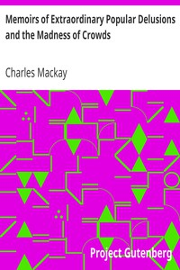

# Memoirs of Extraordinary Popular Delusions and the Madness of Crowds <kbd>24518</kbd>

## Authors

 - Mackay, Charles <small>(1814 - 1889)</small>

## Subjects

 - Alchemy
 - Common fallacies
 - Delusions
 - Hallucinations and illusions
 - Impostors and imposture
 - Investments -- Psychological aspects
 - Occultism -- Early works to 1900
 - Social psychology
 - Stock exchanges -- Psychological aspects
 - Swindlers and swindling

## Download

 - https://www.gutenberg.org/files/24518/24518-h.zip
 - https://www.gutenberg.org/files/24518/24518-0.zip
 - https://www.gutenberg.org/cache/epub/24518/pg24518.cover.small.jpg
 - https://www.gutenberg.org/ebooks/24518.html.images
 - https://www.gutenberg.org/ebooks/24518.epub.images
 - https://www.gutenberg.org/ebooks/24518.kindle.images
 - https://www.gutenberg.org/ebooks/24518.rdf

## Book Shelves

 - Psychology
 - Witchcraft
