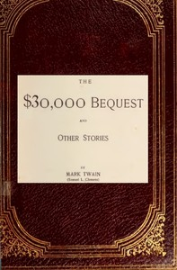

# The $30,000 Bequest, and Other Stories <kbd>142</kbd>

## Authors

 - Twain, Mark <small>(1835 - 1910)</small>

## Subjects

 - Humorous stories, American
 - Short stories
 - United States -- Social life and customs -- Fiction

## Download

 - https://www.gutenberg.org/files/142/142-0.zip
 - https://www.gutenberg.org/cache/epub/142/pg142.cover.small.jpg
 - https://www.gutenberg.org/files/142/142-h/142-h.htm
 - https://www.gutenberg.org/ebooks/142.html.images
 - https://www.gutenberg.org/ebooks/142.kindle.images
 - https://www.gutenberg.org/ebooks/142.rdf
 - https://www.gutenberg.org/ebooks/142.epub.images

## Book Shelves

