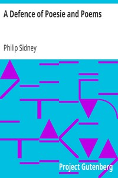

# A Defence of Poesie and Poems <kbd>1962</kbd>

## Authors

 - Sidney, Philip <small>(1554 - 1586)</small>

## Subjects

 - Poetry -- Early works to 1800

## Download

 - https://www.gutenberg.org/files/1962/1962-0.zip
 - https://www.gutenberg.org/cache/epub/1962/pg1962.cover.medium.jpg
 - https://www.gutenberg.org/ebooks/1962.html.images
 - https://www.gutenberg.org/files/1962/1962-0.txt
 - https://www.gutenberg.org/ebooks/1962.rdf
 - https://www.gutenberg.org/ebooks/1962.epub.images
 - https://www.gutenberg.org/ebooks/1962.kindle.images

## Book Shelves

