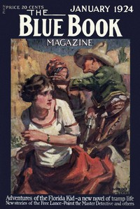

# The Plymouth Express Affair <kbd>66446</kbd>

## Authors

 - Christie, Agatha <small>(1890 - 1976)</small>

## Subjects

 - Detective and mystery stories
 - Murder -- Investigation -- Fiction
 - Poirot, Hercule (Fictitious character) -- Fiction
 - Short stories

## Download

 - https://www.gutenberg.org/files/66446/66446-h/66446-h.htm
 - https://www.gutenberg.org/cache/epub/66446/pg66446.cover.small.jpg
 - https://www.gutenberg.org/files/66446/66446-0.zip
 - https://www.gutenberg.org/ebooks/66446.kindle.images
 - https://www.gutenberg.org/ebooks/66446.rdf
 - https://www.gutenberg.org/ebooks/66446.txt.utf-8
 - https://www.gutenberg.org/ebooks/66446.epub.images
 - https://www.gutenberg.org/files/66446/66446-0.txt

## Book Shelves

