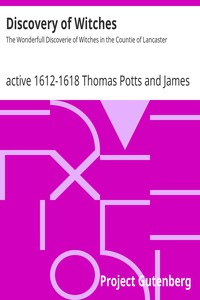

# Discovery of Witches: The Wonderfull Discoverie of Witches in the Countie of Lancaster <kbd>18253</kbd>

## Authors

 - Potts, Thomas, active 1612-1618 <small>(null - null)</small>

## Subjects

 - Preston, Jennet, -1612
 - Witchcraft -- England -- Lancashire

## Download

 - https://www.gutenberg.org/files/18253/18253-8.zip
 - https://www.gutenberg.org/files/18253/18253-h.zip
 - https://www.gutenberg.org/files/18253/18253.zip
 - https://www.gutenberg.org/cache/epub/18253/pg18253.cover.medium.jpg
 - https://www.gutenberg.org/files/18253/18253-8.txt
 - https://www.gutenberg.org/ebooks/18253.html.images
 - https://www.gutenberg.org/ebooks/18253.txt.utf-8
 - https://www.gutenberg.org/ebooks/18253.epub.images
 - https://www.gutenberg.org/ebooks/18253.rdf
 - https://www.gutenberg.org/ebooks/18253.kindle.images

## Book Shelves

 - Witchcraft
