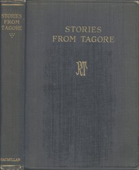

# Stories from Tagore <kbd>33525</kbd>

## Authors

 - Tagore, Rabindranath <small>(1861 - 1941)</small>

## Subjects

 - English language -- Textbooks for foreign speakers -- Indic
 - India -- Social life and customs -- Fiction
 - Short stories, Bengali -- Translations into English
 - Tagore, Rabindranath, 1861-1941 -- Translations into English

## Download

 - https://www.gutenberg.org/files/33525/33525-h.zip
 - https://www.gutenberg.org/files/33525/33525.zip
 - https://www.gutenberg.org/files/33525/33525-0.txt
 - https://www.gutenberg.org/cache/epub/33525/pg33525.cover.small.jpg
 - https://www.gutenberg.org/files/33525/33525.txt
 - https://www.gutenberg.org/ebooks/33525.html.images
 - https://www.gutenberg.org/ebooks/33525.epub.images
 - https://www.gutenberg.org/ebooks/33525.rdf
 - https://www.gutenberg.org/ebooks/33525.kindle.images

## Book Shelves

