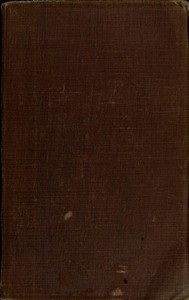

# Music-Study in Germany, from the Home Correspondence of Amy Fay <kbd>37322</kbd>

## Authors

 - Fay, Amy <small>(1844 - 1928)</small>

## Subjects

 - Fay, Amy, 1844-1928
 - Germany -- Social life and customs
 - Music -- Germany
 - Music -- Instruction and study -- Germany
 - Pianists -- United States -- Correspondence

## Download

 - https://www.gutenberg.org/files/37322/37322-8.txt
 - https://www.gutenberg.org/cache/epub/37322/pg37322.cover.small.jpg
 - https://www.gutenberg.org/files/37322/37322-0.zip
 - https://www.gutenberg.org/files/37322/37322-h/37322-h.htm
 - https://www.gutenberg.org/files/37322/37322-0.txt
 - https://www.gutenberg.org/files/37322/37322.txt
 - https://www.gutenberg.org/ebooks/37322.html.images
 - https://www.gutenberg.org/ebooks/37322.rdf
 - https://www.gutenberg.org/ebooks/37322.epub.images
 - https://www.gutenberg.org/ebooks/37322.kindle.images

## Book Shelves

