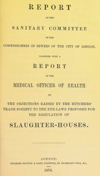

# Report of the Sanitary Committee of the Commissioners of Sewers of the City of London, together with a report of the Medical Officer of Health on the objections raised by the Butchers' Trade Society to the bye-laws proposed for the regulation of slaughter-houses <kbd>67634</kbd>

## Authors

 - Saunders, W. Sedgwick (William Sedgwick) <small>(1824 - 1901)</small>
 - City of London (England). Commissioners of Sewers. Sanitary Committee <small>(null - null)</small>

## Subjects

 - Sewerage
 - Slaughtering and slaughter-houses -- Law and legislation -- Great Britain

## Download

 - https://www.gutenberg.org/cache/epub/67634/pg67634.cover.medium.jpg
 - https://www.gutenberg.org/ebooks/67634.rdf
 - https://www.gutenberg.org/ebooks/67634.epub.images
 - https://www.gutenberg.org/ebooks/67634.txt.utf-8
 - https://www.gutenberg.org/ebooks/67634.kindle.images
 - https://www.gutenberg.org/files/67634/67634-0.zip
 - https://www.gutenberg.org/files/67634/67634-0.txt
 - https://www.gutenberg.org/files/67634/67634-h/67634-h.htm

## Book Shelves

