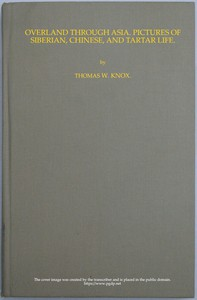

# Overland through Asia; Pictures of Siberian, Chinese, and Tartar Life <kbd>13806</kbd>

## Authors

 - Knox, Thomas Wallace <small>(1835 - 1896)</small>

## Subjects

 - Asia -- Description and travel
 - Siberia (Russia) -- Description and travel

## Download

 - https://www.gutenberg.org/files/13806/13806-h.zip
 - https://www.gutenberg.org/files/13806/13806-h/13806-h.htm
 - https://www.gutenberg.org/cache/epub/13806/pg13806.cover.medium.jpg
 - https://www.gutenberg.org/files/13806/13806-0.txt
 - https://www.gutenberg.org/ebooks/13806.txt.utf-8
 - https://www.gutenberg.org/ebooks/13806.epub.images
 - https://www.gutenberg.org/ebooks/13806.rdf
 - https://www.gutenberg.org/ebooks/13806.kindle.images

## Book Shelves

