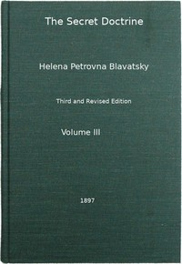

# The Secret Doctrine, Vol. 3 of 4: The Synthesis of Science, Religion, and Philosophy <kbd>56880</kbd>

## Authors

 - Blavatsky, H. P. (Helena Petrovna) <small>(1831 - 1891)</small>

## Subjects

 - Theosophy

## Download

 - https://www.gutenberg.org/ebooks/56880.html.images
 - https://www.gutenberg.org/cache/epub/56880/pg56880.cover.small.jpg
 - https://www.gutenberg.org/files/56880/56880-0.zip
 - https://www.gutenberg.org/files/56880/56880-h.zip
 - https://www.gutenberg.org/files/56880/56880.zip
 - https://www.gutenberg.org/files/56880/56880-0.txt
 - https://www.gutenberg.org/files/56880/56880-8.txt
 - https://www.gutenberg.org/files/56880/56880-tei/56880-tei.tei
 - https://www.gutenberg.org/ebooks/56880.rdf
 - https://www.gutenberg.org/files/56880/56880-pdf.pdf
 - https://www.gutenberg.org/ebooks/56880.epub.images
 - https://www.gutenberg.org/ebooks/56880.kindle.images

## Book Shelves

