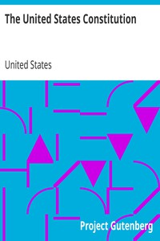

# The United States Constitution <kbd>5</kbd>

## Authors

 - United States <small>(null - null)</small>

## Subjects

 - United States -- Politics and government -- 1783-1789 -- Sources
 - United States. Constitution

## Download

 - https://www.gutenberg.org/files/5/5.zip
 - https://www.gutenberg.org/cache/epub/5/pg5.cover.medium.jpg
 - https://www.gutenberg.org/files/5/5-h.zip
 - https://www.gutenberg.org/ebooks/5.html.images
 - https://www.gutenberg.org/ebooks/5.kindle.images
 - https://www.gutenberg.org/ebooks/5.txt.utf-8
 - https://www.gutenberg.org/ebooks/5.rdf
 - https://www.gutenberg.org/ebooks/5.epub.images

## Book Shelves

 - American Revolutionary War
 - Politics
 - United States
 - United States Law
