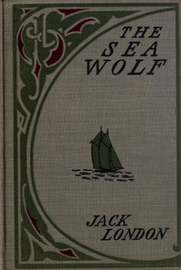

# The Sea-Wolf <kbd>1074</kbd>

## Authors

 - London, Jack <small>(1876 - 1916)</small>

## Subjects

 - Arctic regions -- Fiction
 - Sea stories
 - Sealers (Persons) -- Fiction
 - Sealing ships -- Fiction
 - Ship captains -- Fiction

## Download

 - https://www.gutenberg.org/ebooks/1074.html.images
 - https://www.gutenberg.org/files/1074/1074-0.zip
 - https://www.gutenberg.org/cache/epub/1074/pg1074.cover.medium.jpg
 - https://www.gutenberg.org/files/1074/1074-h.zip
 - https://www.gutenberg.org/ebooks/1074.txt.utf-8
 - https://www.gutenberg.org/files/1074/1074-0.txt
 - https://www.gutenberg.org/ebooks/1074.rdf
 - https://www.gutenberg.org/ebooks/1074.epub.images
 - https://www.gutenberg.org/ebooks/1074.kindle.images

## Book Shelves

