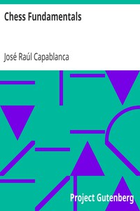

# Chess Fundamentals <kbd>33870</kbd>

## Authors

 - Capablanca, José Raúl <small>(1888 - 1942)</small>

## Subjects

 - Chess

## Download

 - https://www.gutenberg.org/cache/epub/33870/pg33870.cover.medium.jpg
 - https://www.gutenberg.org/files/33870/33870-8.txt
 - https://www.gutenberg.org/files/33870/33870.txt
 - https://www.gutenberg.org/files/33870/33870-h/33870-h.htm
 - https://www.gutenberg.org/files/33870/33870-h.zip
 - https://www.gutenberg.org/ebooks/33870.html.images
 - https://www.gutenberg.org/ebooks/33870.kindle.images
 - https://www.gutenberg.org/ebooks/33870.rdf
 - https://www.gutenberg.org/ebooks/33870.txt.utf-8
 - https://www.gutenberg.org/ebooks/33870.epub.images

## Book Shelves

