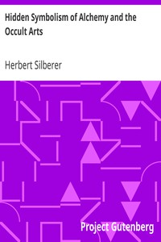

# Hidden Symbolism of Alchemy and the Occult Arts <kbd>27755</kbd>

## Authors

 - Silberer, Herbert <small>(1882 - 1922)</small>

## Subjects

 - Alchemy
 - Society of Rosicrucians
 - Symbolism (Psychology)

## Download

 - https://www.gutenberg.org/files/27755/27755.txt
 - https://www.gutenberg.org/files/27755/27755-0.txt
 - https://www.gutenberg.org/files/27755/27755-pdf.pdf
 - https://www.gutenberg.org/cache/epub/27755/pg27755.cover.medium.jpg
 - https://www.gutenberg.org/files/27755/27755-tei.zip
 - https://www.gutenberg.org/files/27755/27755-0.zip
 - https://www.gutenberg.org/files/27755/27755-h/27755-h.html
 - https://www.gutenberg.org/ebooks/27755.html.images
 - https://www.gutenberg.org/files/27755/27755-8.txt
 - https://www.gutenberg.org/ebooks/27755.rdf
 - https://www.gutenberg.org/ebooks/27755.epub.images
 - https://www.gutenberg.org/ebooks/27755.kindle.images

## Book Shelves

