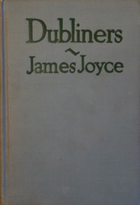

# Dubliners <kbd>2814</kbd>

## Authors

 - Joyce, James <small>(1882 - 1941)</small>

## Subjects

 - Dublin (Ireland) -- Fiction
 - Short stories

## Download

 - https://www.gutenberg.org/files/2814/2814-h.zip
 - https://www.gutenberg.org/files/2814/2814-h/2814-h.htm
 - https://www.gutenberg.org/files/2814/2814-0.txt
 - https://www.gutenberg.org/cache/epub/2814/pg2814.cover.small.jpg
 - https://www.gutenberg.org/ebooks/2814.html.images
 - https://www.gutenberg.org/ebooks/2814.rdf
 - https://www.gutenberg.org/ebooks/2814.epub.images
 - https://www.gutenberg.org/ebooks/2814.kindle.images

## Book Shelves

 - Banned Books from Anne Haight's list
