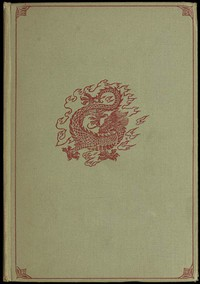

# Korean Folk Tales: Imps, Ghosts and Faries <kbd>51002</kbd>

## Authors

 - Yi, Yuk <small>(1438 - 1498)</small>
 - Im, Pang <small>(1640 - 1724)</small>

## Subjects

 - Folklore -- Korea
 - Tales -- Korea

## Download

 - https://www.gutenberg.org/cache/epub/51002/pg51002.cover.small.jpg
 - https://www.gutenberg.org/files/51002/51002-h.zip
 - https://www.gutenberg.org/files/51002/51002-h/51002-h.htm
 - https://www.gutenberg.org/files/51002/51002-8.txt
 - https://www.gutenberg.org/ebooks/51002.html.images
 - https://www.gutenberg.org/ebooks/51002.txt.utf-8
 - https://www.gutenberg.org/ebooks/51002.rdf
 - https://www.gutenberg.org/ebooks/51002.epub.images
 - https://www.gutenberg.org/ebooks/51002.kindle.images

## Book Shelves

