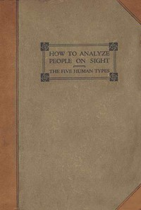

# How to Analyze People on Sight: Through the Science of Human Analysis: The Five Human Types <kbd>30601</kbd>

## Authors

 - Benedict, Ralph Paine <small>(null - null)</small>
 - Benedict, Elsie Lincoln <small>(null - null)</small>

## Subjects

 - Characters and characteristics

## Download

 - https://www.gutenberg.org/files/30601/30601.zip
 - https://www.gutenberg.org/files/30601/30601-8.zip
 - https://www.gutenberg.org/files/30601/30601-h.zip
 - https://www.gutenberg.org/cache/epub/30601/pg30601.cover.small.jpg
 - https://www.gutenberg.org/files/30601/30601-h/30601-h.htm
 - https://www.gutenberg.org/ebooks/30601.html.images
 - https://www.gutenberg.org/ebooks/30601.txt.utf-8
 - https://www.gutenberg.org/ebooks/30601.epub.images
 - https://www.gutenberg.org/ebooks/30601.kindle.images
 - https://www.gutenberg.org/ebooks/30601.rdf

## Book Shelves

