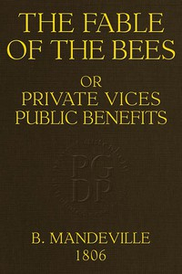

# The Fable of the Bees; Or, Private Vices, Public Benefits <kbd>57260</kbd>

## Authors

 - Mandeville, Bernard <small>(1670 - 1733)</small>

## Subjects

 - Charity-schools -- Early works to 1800
 - Ethics -- Early works to 1800
 - Virtue -- Early works to 1800

## Download

 - https://www.gutenberg.org/files/57260/57260.txt
 - https://www.gutenberg.org/files/57260/57260-h.zip
 - https://www.gutenberg.org/files/57260/57260-h/57260-h.htm
 - https://www.gutenberg.org/cache/epub/57260/pg57260.cover.medium.jpg
 - https://www.gutenberg.org/ebooks/57260.html.images
 - https://www.gutenberg.org/files/57260/57260-8.txt
 - https://www.gutenberg.org/ebooks/57260.txt.utf-8
 - https://www.gutenberg.org/ebooks/57260.rdf
 - https://www.gutenberg.org/ebooks/57260.epub.images
 - https://www.gutenberg.org/ebooks/57260.kindle.images

## Book Shelves

