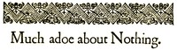

# Much Ado about Nothing <kbd>1519</kbd>

## Authors

 - Shakespeare, William <small>(1564 - 1616)</small>

## Subjects

 - Comedies
 - Conspiracies -- Drama
 - Courtship -- Drama
 - Messina (Italy) -- Drama
 - Rejection (Psychology) -- Drama

## Download

 - https://www.gutenberg.org/ebooks/1519.html.images
 - https://www.gutenberg.org/files/1519/1519-0.zip
 - https://www.gutenberg.org/files/1519/1519-h.zip
 - https://www.gutenberg.org/ebooks/1519.txt.utf-8
 - https://www.gutenberg.org/files/1519/1519-0.txt
 - https://www.gutenberg.org/cache/epub/1519/pg1519.cover.small.jpg
 - https://www.gutenberg.org/ebooks/1519.rdf
 - https://www.gutenberg.org/ebooks/1519.epub.images
 - https://www.gutenberg.org/ebooks/1519.kindle.images

## Book Shelves

