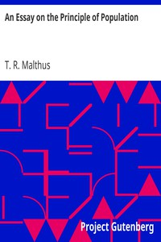

# An Essay on the Principle of Population <kbd>4239</kbd>

## Authors

 - Malthus, T. R. (Thomas Robert) <small>(1766 - 1834)</small>

## Subjects

 - Population

## Download

 - https://www.gutenberg.org/files/4239/4239-h/4239-h.htm
 - https://www.gutenberg.org/files/4239/4239.txt
 - https://www.gutenberg.org/cache/epub/4239/pg4239.cover.small.jpg
 - https://www.gutenberg.org/ebooks/4239.html.images
 - https://www.gutenberg.org/ebooks/4239.kindle.images
 - https://www.gutenberg.org/ebooks/4239.rdf
 - https://www.gutenberg.org/ebooks/4239.txt.utf-8
 - https://www.gutenberg.org/ebooks/4239.epub.images

## Book Shelves

