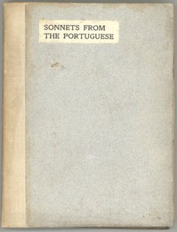

# Sonnets from the Portuguese <kbd>2002</kbd>

## Authors

 - Browning, Elizabeth Barrett <small>(1806 - 1861)</small>

## Subjects

 - Love poetry, English
 - Sonnets, English

## Download

 - https://www.gutenberg.org/files/2002/2002-h.zip
 - https://www.gutenberg.org/files/2002/2002.zip
 - https://www.gutenberg.org/files/2002/2002-0.zip
 - https://www.gutenberg.org/cache/epub/2002/pg2002.cover.medium.jpg
 - https://www.gutenberg.org/ebooks/2002.html.images
 - https://www.gutenberg.org/files/2002/2002-0.txt
 - https://www.gutenberg.org/ebooks/2002.kindle.images
 - https://www.gutenberg.org/ebooks/2002.rdf
 - https://www.gutenberg.org/ebooks/2002.epub.images

## Book Shelves

