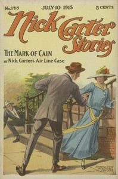

# Nick Carter Stories No. 148, July 10, 1915 <kbd>67615</kbd>

## Authors

 - Carter, Nicholas (House name) <small>(null - null)</small>
 - Boston, Ralph <small>(null - null)</small>

## Subjects

 - Detective and mystery stories, American -- Periodicals
 - Popular literature -- Periodicals

## Download

 - https://www.gutenberg.org/files/67615/67615-h.zip
 - https://www.gutenberg.org/files/67615/67615-h/67615-h.htm
 - https://www.gutenberg.org/files/67615/67615-0.zip
 - https://www.gutenberg.org/ebooks/67615.rdf
 - https://www.gutenberg.org/cache/epub/67615/pg67615.cover.medium.jpg
 - https://www.gutenberg.org/ebooks/67615.txt.utf-8
 - https://www.gutenberg.org/ebooks/67615.epub.images
 - https://www.gutenberg.org/ebooks/67615.kindle.images
 - https://www.gutenberg.org/files/67615/67615-0.txt

## Book Shelves

