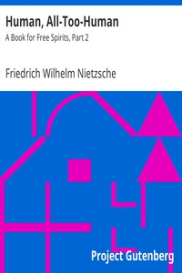

# Human, All-Too-Human: A Book for Free Spirits, Part 2 <kbd>37841</kbd>

## Authors

 - Nietzsche, Friedrich Wilhelm <small>(1844 - 1900)</small>

## Subjects

 - Human beings

## Download

 - https://www.gutenberg.org/files/37841/37841-pdf.zip
 - https://www.gutenberg.org/files/37841/37841-h.zip
 - https://www.gutenberg.org/files/37841/37841-0.zip
 - https://www.gutenberg.org/cache/epub/37841/pg37841.cover.medium.jpg
 - https://www.gutenberg.org/files/37841/37841-8.zip
 - https://www.gutenberg.org/files/37841/37841-8.txt
 - https://www.gutenberg.org/files/37841/37841.txt
 - https://www.gutenberg.org/ebooks/37841.html.images
 - https://www.gutenberg.org/ebooks/37841.kindle.images
 - https://www.gutenberg.org/ebooks/37841.epub.images
 - https://www.gutenberg.org/ebooks/37841.rdf
 - https://www.gutenberg.org/files/37841/37841-tei/37841-tei.tei

## Book Shelves

