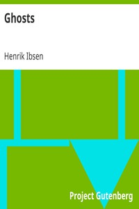

# Ghosts <kbd>8121</kbd>

## Authors

 - Ibsen, Henrik <small>(1828 - 1906)</small>

## Subjects

 - Domestic drama
 - Europe -- Social conditions -- 19th century -- Drama
 - Families -- Drama
 - Mothers and sons -- Drama
 - Norwegian drama -- Translations into English
 - Tragedies

## Download

 - https://www.gutenberg.org/cache/epub/8121/pg8121.cover.medium.jpg
 - https://www.gutenberg.org/files/8121/8121-8.txt
 - https://www.gutenberg.org/files/8121/8121-h.zip
 - https://www.gutenberg.org/files/8121/8121-h/8121-h.htm
 - https://www.gutenberg.org/ebooks/8121.html.images
 - https://www.gutenberg.org/ebooks/8121.rdf
 - https://www.gutenberg.org/ebooks/8121.kindle.images
 - https://www.gutenberg.org/ebooks/8121.epub.images
 - https://www.gutenberg.org/ebooks/8121.txt.utf-8

## Book Shelves

 - Banned Books from Anne Haight's list
