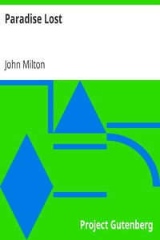

# Paradise Lost <kbd>26</kbd>

## Authors

 - Milton, John <small>(1608 - 1674)</small>

## Subjects

 - Adam (Biblical figure) -- Poetry
 - Bible. Genesis -- History of Biblical events -- Poetry
 - Eve (Biblical figure) -- Poetry
 - Fall of man -- Poetry

## Download

 - https://www.gutenberg.org/cache/epub/26/pg26.cover.medium.jpg
 - https://www.gutenberg.org/files/26/26-h.zip
 - https://www.gutenberg.org/ebooks/26.html.images
 - https://www.gutenberg.org/files/26/26-0.txt
 - https://www.gutenberg.org/ebooks/26.kindle.images
 - https://www.gutenberg.org/ebooks/26.txt.utf-8
 - https://www.gutenberg.org/ebooks/26.rdf
 - https://www.gutenberg.org/ebooks/26.epub.images

## Book Shelves

