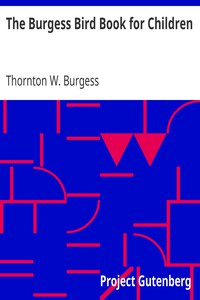

# The Burgess Bird Book for Children <kbd>3074</kbd>

## Authors

 - Burgess, Thornton W. (Thornton Waldo) <small>(1874 - 1965)</small>

## Subjects

 - Birds -- Juvenile literature

## Download

 - https://www.gutenberg.org/files/3074/3074-0.zip
 - https://www.gutenberg.org/files/3074/3074.zip
 - https://www.gutenberg.org/cache/epub/3074/pg3074.cover.medium.jpg
 - https://www.gutenberg.org/files/3074/3074-h/3074-h.htm
 - https://www.gutenberg.org/files/3074/3074-0.txt
 - https://www.gutenberg.org/ebooks/3074.html.images
 - https://www.gutenberg.org/ebooks/3074.rdf
 - https://www.gutenberg.org/ebooks/3074.epub.images
 - https://www.gutenberg.org/ebooks/3074.kindle.images

## Book Shelves

