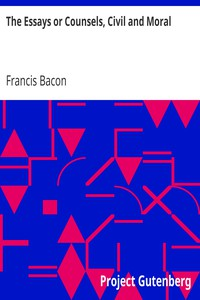

# The Essays or Counsels, Civil and Moral <kbd>575</kbd>

## Authors

 - Bacon, Francis <small>(1561 - 1626)</small>

## Subjects

 - English essays -- Early modern, 1500-1700

## Download

 - https://www.gutenberg.org/files/575/575-h/575-h.htm
 - https://www.gutenberg.org/files/575/575-h.zip
 - https://www.gutenberg.org/cache/epub/575/pg575.cover.small.jpg
 - https://www.gutenberg.org/files/575/575.txt
 - https://www.gutenberg.org/ebooks/575.html.images
 - https://www.gutenberg.org/ebooks/575.kindle.images
 - https://www.gutenberg.org/ebooks/575.txt.utf-8
 - https://www.gutenberg.org/ebooks/575.rdf
 - https://www.gutenberg.org/ebooks/575.epub.images

## Book Shelves

 - Harvard Classics
