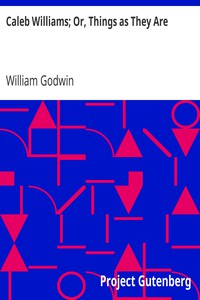

# Caleb Williams; Or, Things as They Are <kbd>11323</kbd>

## Authors

 - Godwin, William <small>(1756 - 1836)</small>

## Subjects

 - Bildungsromans
 - Didactic fiction
 - England -- Fiction
 - Executions and executioners -- Fiction
 - False imprisonment -- Fiction
 - Master and servant -- Fiction
 - Murderers -- Fiction
 - Young men -- Fiction

## Download

 - https://www.gutenberg.org/files/11323/11323.zip
 - https://www.gutenberg.org/cache/epub/11323/pg11323.cover.small.jpg
 - https://www.gutenberg.org/files/11323/11323-h/11323-h.htm
 - https://www.gutenberg.org/files/11323/11323-8.txt
 - https://www.gutenberg.org/ebooks/11323.html.images
 - https://www.gutenberg.org/ebooks/11323.txt.utf-8
 - https://www.gutenberg.org/ebooks/11323.rdf
 - https://www.gutenberg.org/ebooks/11323.epub.images
 - https://www.gutenberg.org/ebooks/11323.kindle.images

## Book Shelves

 - Gothic Fiction
