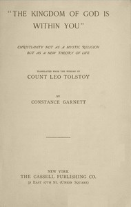

# "The Kingdom of God Is Within You": Christianity Not as a Mystic Religion but as a New Theory of Life <kbd>43302</kbd>

## Authors

 - Tolstoy, Leo, graf <small>(1828 - 1910)</small>

## Subjects

 - Christianity -- Controversial literature
 - Christianity -- Essence, genius, nature
 - Government, Resistance to -- Religious aspects -- Christianity
 - Nonviolence -- Religious aspects -- Christianity

## Download

 - https://www.gutenberg.org/files/43302/43302.txt
 - https://www.gutenberg.org/files/43302/43302.zip
 - https://www.gutenberg.org/files/43302/43302-8.zip
 - https://www.gutenberg.org/files/43302/43302-h/43302-h.htm
 - https://www.gutenberg.org/files/43302/43302-0.zip
 - https://www.gutenberg.org/cache/epub/43302/pg43302.cover.medium.jpg
 - https://www.gutenberg.org/ebooks/43302.html.images
 - https://www.gutenberg.org/ebooks/43302.kindle.images
 - https://www.gutenberg.org/ebooks/43302.rdf
 - https://www.gutenberg.org/ebooks/43302.epub.images

## Book Shelves

