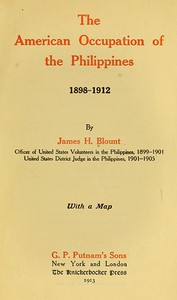

# The American Occupation of the Philippines 1898-1912 <kbd>36542</kbd>

## Authors

 - Blount, James H. (James Henderson) <small>(1869 - 1918)</small>

## Subjects

 - Philippines -- History -- 1898-1946
 - Philippines -- Politics and government -- 1898-1935

## Download

 - https://www.gutenberg.org/files/36542/36542-8.txt
 - https://www.gutenberg.org/files/36542/36542.zip
 - https://www.gutenberg.org/cache/epub/36542/pg36542.cover.small.jpg
 - https://www.gutenberg.org/files/36542/36542.txt
 - https://www.gutenberg.org/files/36542/36542-h/36542-h.htm
 - https://www.gutenberg.org/ebooks/36542.html.images
 - https://www.gutenberg.org/ebooks/36542.txt.utf-8
 - https://www.gutenberg.org/ebooks/36542.epub.images
 - https://www.gutenberg.org/ebooks/36542.rdf
 - https://www.gutenberg.org/ebooks/36542.kindle.images

## Book Shelves

