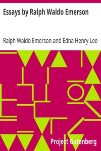

# Essays by Ralph Waldo Emerson <kbd>16643</kbd>

## Authors

 - Emerson, Ralph Waldo <small>(1803 - 1882)</small>

## Subjects

 - Essays

## Download

 - https://www.gutenberg.org/cache/epub/16643/pg16643.cover.small.jpg
 - https://www.gutenberg.org/files/16643/16643-8.zip
 - https://www.gutenberg.org/files/16643/16643.txt
 - https://www.gutenberg.org/files/16643/16643-8.txt
 - https://www.gutenberg.org/files/16643/16643-h/16643-h.htm
 - https://www.gutenberg.org/ebooks/16643.html.images
 - https://www.gutenberg.org/ebooks/16643.txt.utf-8
 - https://www.gutenberg.org/ebooks/16643.epub.images
 - https://www.gutenberg.org/ebooks/16643.rdf
 - https://www.gutenberg.org/ebooks/16643.kindle.images

## Book Shelves

 - Harvard Classics
