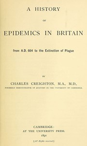

# A History of Epidemics in Britain, Volume 1 (of 2): From A.D. 664 to the Extinction of Plague <kbd>42686</kbd>

## Authors

 - Creighton, Charles <small>(1847 - 1927)</small>

## Subjects

 - Epidemics -- Great Britain -- History

## Download

 - https://www.gutenberg.org/files/42686/42686-h.zip
 - https://www.gutenberg.org/files/42686/42686-0.zip
 - https://www.gutenberg.org/files/42686/42686-8.txt
 - https://www.gutenberg.org/files/42686/42686-h/42686-h.htm
 - https://www.gutenberg.org/files/42686/42686.txt
 - https://www.gutenberg.org/ebooks/42686.html.images
 - https://www.gutenberg.org/cache/epub/42686/pg42686.cover.medium.jpg
 - https://www.gutenberg.org/ebooks/42686.rdf
 - https://www.gutenberg.org/ebooks/42686.kindle.images
 - https://www.gutenberg.org/ebooks/42686.epub.images

## Book Shelves

