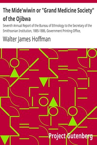

# The Mide'wiwin or "Grand Medicine Society" of the Ojibwa: Seventh Annual Report of the Bureau of Ethnology to the Secretary of the Smithsonian Institution, 1885-1886, Government Printing Office, Washington, 1891, pages 143-300 <kbd>19368</kbd>

## Authors

 - Hoffman, Walter James <small>(1846 - 1899)</small>

## Subjects

 - Midéwiwin
 - Ojibwa Indians -- Religion
 - Ojibwa Indians -- Rites and ceremonies
 - Ojibwa Indians -- Societies, etc.
 - Secret societies -- North America

## Download

 - https://www.gutenberg.org/files/19368/19368-h/files/music207_1.ly
 - https://www.gutenberg.org/files/19368/19368-h/files/music267_1_flute.midi
 - https://www.gutenberg.org/cache/epub/19368/pg19368.cover.small.jpg
 - https://www.gutenberg.org/files/19368/19368-0.txt
 - https://www.gutenberg.org/files/19368/19368-h/19368-h.htm
 - https://www.gutenberg.org/files/19368/19368.zip
 - https://www.gutenberg.org/files/19368/19368.txt
 - https://www.gutenberg.org/ebooks/19368.html.images
 - https://www.gutenberg.org/ebooks/19368.epub.images
 - https://www.gutenberg.org/ebooks/19368.rdf
 - https://www.gutenberg.org/ebooks/19368.kindle.images

## Book Shelves

 - Paganism
