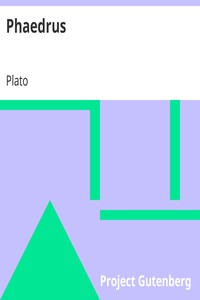

# Phaedrus <kbd>1636</kbd>

## Authors

 - Plato <small>(-428 - -348)</small>

## Subjects

 - Classical literature
 - Love -- Early works to 1800
 - Lysias
 - Rhetoric -- Early works to 1800
 - Rhetoric, Ancient
 - Socrates, 470 BC-399 BC
 - Soul -- Early works to 1800

## Download

 - https://www.gutenberg.org/cache/epub/1636/pg1636.cover.small.jpg
 - https://www.gutenberg.org/files/1636/1636-h.zip
 - https://www.gutenberg.org/files/1636/1636-h/1636-h.htm
 - https://www.gutenberg.org/files/1636/1636.txt
 - https://www.gutenberg.org/ebooks/1636.html.images
 - https://www.gutenberg.org/ebooks/1636.rdf
 - https://www.gutenberg.org/ebooks/1636.epub.images
 - https://www.gutenberg.org/ebooks/1636.kindle.images
 - https://www.gutenberg.org/ebooks/1636.txt.utf-8

## Book Shelves

