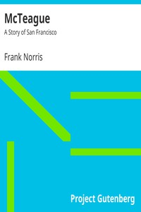

# McTeague: A Story of San Francisco <kbd>165</kbd>

## Authors

 - Norris, Frank <small>(1870 - 1902)</small>

## Subjects

 - Avarice -- Fiction
 - Dentists -- Fiction
 - Didactic fiction
 - Married people -- Fiction
 - Murderers -- Fiction
 - Psychological fiction
 - San Francisco (Calif.) -- Fiction

## Download

 - https://www.gutenberg.org/files/165/165-8.zip
 - https://www.gutenberg.org/cache/epub/165/pg165.cover.small.jpg
 - https://www.gutenberg.org/files/165/165-8.txt
 - https://www.gutenberg.org/files/165/165.zip
 - https://www.gutenberg.org/files/165/165-h/165-h.htm
 - https://www.gutenberg.org/ebooks/165.html.images
 - https://www.gutenberg.org/ebooks/165.kindle.images
 - https://www.gutenberg.org/files/165/165-0.txt
 - https://www.gutenberg.org/ebooks/165.rdf
 - https://www.gutenberg.org/ebooks/165.epub.images

## Book Shelves

