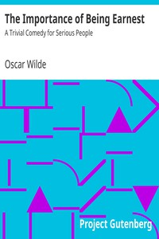

# The Importance of Being Earnest: A Trivial Comedy for Serious People <kbd>844</kbd>

## Authors

 - Wilde, Oscar <small>(1854 - 1900)</small>

## Subjects

 - Comedies
 - England -- Drama
 - Foundlings -- Drama
 - Identity (Psychology) -- Drama

## Download

 - https://www.gutenberg.org/files/844/844-h/844-h.htm
 - https://www.gutenberg.org/cache/epub/844/pg844.cover.medium.jpg
 - https://www.gutenberg.org/files/844/844-h.zip
 - https://www.gutenberg.org/files/844/844-0.zip
 - https://www.gutenberg.org/ebooks/844.kindle.images
 - https://www.gutenberg.org/ebooks/844.rdf
 - https://www.gutenberg.org/ebooks/844.epub.images

## Book Shelves

 - Plays
