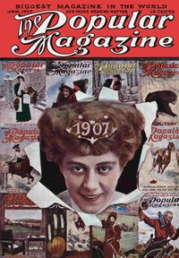

# Object, Matrimony <kbd>67516</kbd>

## Authors

 - Bower, B. M. <small>(1871 - 1940)</small>

## Subjects

 - Montana -- Fiction
 - Short stories
 - Western stories

## Download

 - https://www.gutenberg.org/cache/epub/67516/pg67516.cover.small.jpg
 - https://www.gutenberg.org/ebooks/67516.rdf
 - https://www.gutenberg.org/ebooks/67516.txt.utf-8
 - https://www.gutenberg.org/ebooks/67516.epub.images
 - https://www.gutenberg.org/ebooks/67516.html.images
 - https://www.gutenberg.org/files/67516/67516-0.zip
 - https://www.gutenberg.org/ebooks/67516.kindle.images
 - https://www.gutenberg.org/files/67516/67516-0.txt

## Book Shelves

