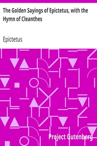

# The Golden Sayings of Epictetus, with the Hymn of Cleanthes <kbd>871</kbd>

## Authors

 - Epictetus <small>(55 - 135)</small>

## Subjects

 - Philosophy
 - Stoics

## Download

 - https://www.gutenberg.org/files/871/871-8.zip
 - https://www.gutenberg.org/files/871/871-h/871-h.htm
 - https://www.gutenberg.org/files/871/871-8.txt
 - https://www.gutenberg.org/cache/epub/871/pg871.cover.small.jpg
 - https://www.gutenberg.org/files/871/871.txt
 - https://www.gutenberg.org/ebooks/871.html.images
 - https://www.gutenberg.org/ebooks/871.kindle.images
 - https://www.gutenberg.org/ebooks/871.txt.utf-8
 - https://www.gutenberg.org/ebooks/871.rdf
 - https://www.gutenberg.org/ebooks/871.epub.images

## Book Shelves

 - Classical Antiquity
 - Harvard Classics
