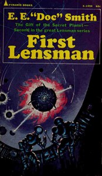

# First Lensman <kbd>49525</kbd>

## Authors

 - Smith, E. E. (Edward Elmer) <small>(1890 - 1965)</small>

## Subjects

 - Human-alien encounters -- Fiction
 - Imaginary wars and battles -- Fiction
 - Outer space -- Exploration -- Fiction
 - Psychic ability -- Fiction
 - Science fiction
 - Space colonies -- Fiction
 - Space security -- Fiction
 - Space warfare -- Fiction

## Download

 - https://www.gutenberg.org/files/49525/49525-h.zip
 - https://www.gutenberg.org/cache/epub/49525/pg49525.cover.small.jpg
 - https://www.gutenberg.org/ebooks/49525.html.images
 - https://www.gutenberg.org/files/49525/49525-8.txt
 - https://www.gutenberg.org/ebooks/49525.txt.utf-8
 - https://www.gutenberg.org/ebooks/49525.epub.images
 - https://www.gutenberg.org/ebooks/49525.rdf
 - https://www.gutenberg.org/ebooks/49525.kindle.images

## Book Shelves

 - Science Fiction
