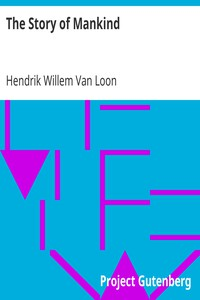

# The Story of Mankind <kbd>754</kbd>

## Authors

 - Van Loon, Hendrik Willem <small>(1882 - 1944)</small>

## Subjects

 - World history
 - World history -- Juvenile literature

## Download

 - https://www.gutenberg.org/files/754/754-h/754-h.htm
 - https://www.gutenberg.org/cache/epub/754/pg754.cover.small.jpg
 - https://www.gutenberg.org/files/754/754-h.zip
 - https://www.gutenberg.org/files/754/754.txt
 - https://www.gutenberg.org/ebooks/754.html.images
 - https://www.gutenberg.org/ebooks/754.kindle.images
 - https://www.gutenberg.org/ebooks/754.txt.utf-8
 - https://www.gutenberg.org/ebooks/754.rdf
 - https://www.gutenberg.org/ebooks/754.epub.images

## Book Shelves

 - Bestsellers, American, 1895-1923
 - Children's History
