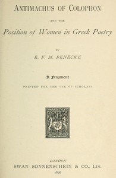

# Antimachus of Colophon and the Position of Women in Greek Poetry: A fragment printed for the use of scholars <kbd>67573</kbd>

## Authors

 - Benecke, E. F. M. (Edward Felix Mendelssohn) <small>(1870 - 1895)</small>

## Subjects

 - Antimachus, of Colophon -- Characters
 - Greek poetry -- History and criticism
 - Women and literature -- Greece
 - Women in literature

## Download

 - https://www.gutenberg.org/cache/epub/67573/pg67573.cover.medium.jpg
 - https://www.gutenberg.org/ebooks/67573.txt.utf-8
 - https://www.gutenberg.org/ebooks/67573.html.images
 - https://www.gutenberg.org/ebooks/67573.rdf
 - https://www.gutenberg.org/ebooks/67573.epub.images
 - https://www.gutenberg.org/ebooks/67573.kindle.images
 - https://www.gutenberg.org/files/67573/67573-h.zip
 - https://www.gutenberg.org/files/67573/67573-0.zip
 - https://www.gutenberg.org/files/67573/67573-0.txt

## Book Shelves

