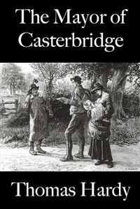

# The Mayor of Casterbridge <kbd>143</kbd>

## Authors

 - Hardy, Thomas <small>(1840 - 1928)</small>

## Subjects

 - Atonement -- Fiction
 - Fathers and daughters -- Fiction
 - Mayors -- Fiction
 - Men -- England -- Fiction
 - Psychological fiction
 - Runaway husbands -- Fiction
 - Wessex (England) -- Fiction

## Download

 - https://www.gutenberg.org/files/143/143-h/143-h.htm
 - https://www.gutenberg.org/files/143/143-0.zip
 - https://www.gutenberg.org/cache/epub/143/pg143.cover.medium.jpg
 - https://www.gutenberg.org/files/143/143-0.txt
 - https://www.gutenberg.org/ebooks/143.html.images
 - https://www.gutenberg.org/ebooks/143.kindle.images
 - https://www.gutenberg.org/ebooks/143.rdf
 - https://www.gutenberg.org/ebooks/143.epub.images

## Book Shelves

