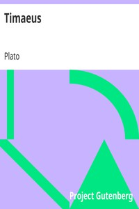

# Timaeus <kbd>1572</kbd>

## Authors

 - Plato <small>(-428 - -348)</small>

## Subjects

 - Classical literature
 - Cosmology -- Early works to 1800

## Download

 - https://www.gutenberg.org/cache/epub/1572/pg1572.cover.small.jpg
 - https://www.gutenberg.org/files/1572/1572-0.zip
 - https://www.gutenberg.org/files/1572/1572-h.zip
 - https://www.gutenberg.org/ebooks/1572.html.images
 - https://www.gutenberg.org/files/1572/1572-0.txt
 - https://www.gutenberg.org/ebooks/1572.rdf
 - https://www.gutenberg.org/ebooks/1572.epub.images
 - https://www.gutenberg.org/ebooks/1572.kindle.images

## Book Shelves

