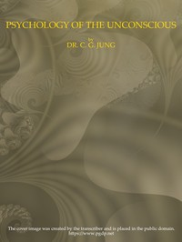

# Psychology of the Unconscious: A Study of the Transformations and Symbolisms of the Libido. A Contribution to the History of the Evolution of Thought <kbd>65903</kbd>

## Authors

 - Jung, C. G. (Carl Gustav) <small>(1875 - 1961)</small>

## Subjects

 - Libido (Psychology)
 - Mother and child
 - Psychoanalysis
 - Subconsciousness
 - Symbolism (Psychology)

## Download

 - https://www.gutenberg.org/files/65903/65903-0.zip
 - https://www.gutenberg.org/cache/epub/65903/pg65903.cover.medium.jpg
 - https://www.gutenberg.org/ebooks/65903.html.images
 - https://www.gutenberg.org/ebooks/65903.kindle.images
 - https://www.gutenberg.org/ebooks/65903.epub.images
 - https://www.gutenberg.org/ebooks/65903.rdf
 - https://www.gutenberg.org/files/65903/65903-h/65903-h.htm

## Book Shelves

