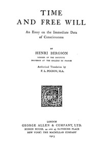

# Time and Free Will: An Essay on the Immediate Data of Consciousness <kbd>56852</kbd>

## Authors

 - Bergson, Henri <small>(1859 - 1941)</small>

## Subjects

 - Consciousness
 - Free will and determinism
 - Space and time

## Download

 - https://www.gutenberg.org/cache/epub/56852/pg56852.cover.small.jpg
 - https://www.gutenberg.org/files/56852/56852-h.zip
 - https://www.gutenberg.org/files/56852/56852-0.zip
 - https://www.gutenberg.org/files/56852/56852-h/56852-h.htm
 - https://www.gutenberg.org/ebooks/56852.html.images
 - https://www.gutenberg.org/ebooks/56852.epub.images
 - https://www.gutenberg.org/ebooks/56852.rdf
 - https://www.gutenberg.org/ebooks/56852.kindle.images

## Book Shelves

