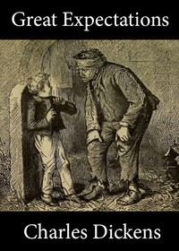

# Great Expectations <kbd>1400</kbd>

## Authors

 - Dickens, Charles <small>(1812 - 1870)</small>

## Subjects

 - Benefactors -- Fiction
 - Bildungsromans
 - England -- Fiction
 - Ex-convicts -- Fiction
 - Man-woman relationships -- Fiction
 - Orphans -- Fiction
 - Revenge -- Fiction
 - Young men -- Fiction

## Download

 - https://www.gutenberg.org/files/1400/1400-0.zip
 - https://www.gutenberg.org/files/1400/1400-h/1400-h.htm
 - https://www.gutenberg.org/cache/epub/1400/pg1400.cover.small.jpg
 - https://www.gutenberg.org/files/1400/1400-0.txt
 - https://www.gutenberg.org/ebooks/1400.html.images
 - https://www.gutenberg.org/ebooks/1400.rdf
 - https://www.gutenberg.org/ebooks/1400.epub.images
 - https://www.gutenberg.org/ebooks/1400.kindle.images

## Book Shelves

 - Best Books Ever Listings
