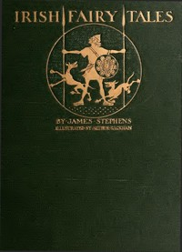

# Irish Fairy Tales <kbd>2892</kbd>

## Authors

 - Stephens, James <small>(1882 - 1950)</small>

## Subjects

 - Fairy tales -- Ireland
 - Folklore -- Ireland
 - Tales -- Ireland

## Download

 - https://www.gutenberg.org/cache/epub/2892/pg2892.cover.small.jpg
 - https://www.gutenberg.org/files/2892/2892-h/2892-h.htm
 - https://www.gutenberg.org/files/2892/2892.txt
 - https://www.gutenberg.org/files/2892/2892-0.zip
 - https://www.gutenberg.org/files/2892/2892-0.txt
 - https://www.gutenberg.org/ebooks/2892.html.images
 - https://www.gutenberg.org/ebooks/2892.epub.images
 - https://www.gutenberg.org/ebooks/2892.rdf
 - https://www.gutenberg.org/ebooks/2892.kindle.images

## Book Shelves

 - Children's Myths, Fairy Tales, etc.
 - Fantasy
 - Folklore
