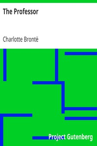

# The Professor <kbd>1028</kbd>

## Authors

 - Brontë, Charlotte <small>(1816 - 1855)</small>

## Subjects

 - Belgium -- Social life and customs -- 19th century -- Fiction
 - British -- Belgium -- Fiction
 - Brussels (Belgium) -- Fiction
 - Love stories
 - Triangles (Interpersonal relations) -- Fiction
 - Women teachers -- Fiction

## Download

 - https://www.gutenberg.org/cache/epub/1028/pg1028.cover.medium.jpg
 - https://www.gutenberg.org/files/1028/1028-0.zip
 - https://www.gutenberg.org/files/1028/1028-h/1028-h.htm
 - https://www.gutenberg.org/ebooks/1028.html.images
 - https://www.gutenberg.org/ebooks/1028.rdf
 - https://www.gutenberg.org/ebooks/1028.epub.images
 - https://www.gutenberg.org/ebooks/1028.kindle.images

## Book Shelves

